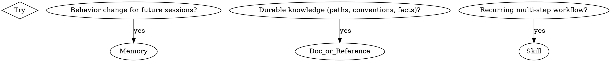

# Session Retrospective

## Overview

Run a structured retrospective at the end of a working session. The skill:

1. Summarizes the session as **Keep / Problem / Try**
2. Cross-references past retrospectives in `~/.claude/retrospectives/` to detect **recurring patterns**
3. Proposes:
   - **Memory entries** (with explicit scope: global vs project)
   - **Documentation updates** (where in the repo to record durable knowledge)
   - **Skill candidates** (recurring workflows worth automating)
4. Writes the retrospective to `~/.claude/retrospectives/YYYY-MM-DD-HHMM-{slug}.md` with structured frontmatter so future runs can analyze it

## When to Use

- User explicitly invokes: "振り返り", "retrospective", "今回のセッションを振り返って", `/session-retrospective`
- User asks to "save lessons learned", "save what we learned", "今回の学びをまとめて"
- End of a substantial working session where memories / docs / skills might need updating

Do NOT trigger on simple `/save-memory` invocations — that's a narrower skill (only handles memory). This skill is the broader orchestrator and **delegates the memory step to the user's existing memory workflow**.

## Workflow

### Step 1: Load past retrospectives (pattern detection)

Read the **frontmatter only** of the most recent ~20 files in `~/.claude/retrospectives/`. Use `ls -t ~/.claude/retrospectives/*.md | head -20` then read each.

Collect the `problem:` tags across past sessions. If any tag appears **3 or more times** (including potentially this session), flag it as a recurring pattern.

### Step 2: Draft Keep / Problem / Try

Review the current conversation and propose:

- **Keep**: 2-4 things that worked well. Specific actions, not vague praise.
- **Problem**: 2-5 things that didn't work or caused friction. Include user corrections, redos, miscommunications. **Be honest** — performative self-criticism is useless; concrete misses are valuable.
- **Try**: For each Problem, propose a concrete change. These become candidates for memory / docs / skills.

If recurring patterns were detected in Step 1, **call them out explicitly**:

> ⚠️ "file-location-guessing" appeared in 3 past retrospectives. A memory was saved on 2026-05-22 ([[confirm-save-location]]) — is it not firing, or is the memory wrong?

### Step 3: Triage Try items

For each Try item, ask: **memory / doc / skill — which?**



In practice, items often map to **multiple** outputs. That's fine.

#### Promotion threshold for durable actions

Do not turn every first occurrence into a new memory, documentation rule, regression
checklist, or skill. Use the recurring-pattern threshold from Step 1 as the default:

- On the first or second occurrence, record the Problem and Try with a stable tag. Make a
  narrow correction to an existing workflow when needed, but defer additional durable rules.
- At about the third occurrence, propose the appropriate memory, documentation update,
  regression check, or skill.
- Act sooner when the issue creates a material security, privacy, data-loss, destructive-action,
  or external-impact risk, or when the user explicitly requests immediate durable action.

State the observed occurrence count and any exception used in the retrospective. Do not claim
recurrence merely because several symptoms appeared in one session.

### Step 4: Determine scope (memory only)

For each memory candidate, **explicitly tag scope** before saving. Use the user's CLAUDE.md rule:

> **Default to global (`~/.claude/CLAUDE.md`, written in English)** unless the knowledge is clearly tied to a specific project.

Examples:
- "Confirm save location before writing files" → **global** (universal behavior)
- "5/17 BD offsite decided X" → **project** (sakana-specific facts)
- "voicelog transcripts live at `/Users/hiroyukiota/voicelog/transcripts/`" → **global reference** (machine-level path)

### Step 5: Write the retrospective file

Save to `~/.claude/retrospectives/YYYY-MM-DD-HHMM-{slug}.md` with this frontmatter:

```yaml
---
date: YYYY-MM-DD
session_slug: short-kebab-case
project: <project name, or "global" if no project>
project_path: <absolute path>
task_summary: |
  1-3 lines of what the session was about.

keep:
  - tag-1
  - tag-2

problem:
  - tag-1
  - tag-2

try:
  - tag-1
  - tag-2

memories_saved:
  - global/feedback/<slug>
  - project/<project>/<slug>
  - global/reference/<slug>

skills_proposed:
  - skill-name

recurring_patterns:
  - pattern: <tag>
    occurred_in: [YYYY-MM-DD, YYYY-MM-DD]
    memory: <slug or "none">
    status: <"new" | "existing memory not firing" | "memory wrong">
---
```

Tags in `keep:` / `problem:` / `try:` MUST be short kebab-case so they aggregate cleanly across sessions. Use the same tag across sessions if it's truly the same pattern — that's how recurrence is detected.

Body: human-readable sections per Keep / Problem / Try, with the *why* and *learning* for each.

### Step 6: Execute the actions

Only propose durable actions that meet the promotion threshold above. For each output category,
**ask the user to confirm before writing**, then:

- **Memory (global)**: append to `~/.claude/CLAUDE.md` under the appropriate `##` section
- **Memory (project)**: write to `/Users/hiroyukiota/.claude/projects/<encoded-project-path>/memory/<slug>.md` with frontmatter, and add a pointer to `MEMORY.md` in the same directory
- **Doc**: edit the relevant file in the project repo
- **Skill**: create a new skill in `~/workspace/hota911/agent-skills/skills/<name>/SKILL.md` and update `marketplace.json` + `README.md`

## Anti-patterns

| ❌ Don't | ✅ Do |
|---|---|
| "セッションは順調でした" type vague Keep | Specific actions: "multi-source-integration: Doc と voicelog 両方から…" |
| Hiding mistakes to look competent | List every redo, file-move, miscommunication. That's where the value is. |
| Save memory with no scope | Always tag global / project / reference. Default to global. |
| Skip the past-retrospective scan | The whole point is detecting recurrence. Always Step 1. |
| Save "I'll do better next time" as memory | Memories must be **actionable rules with why + how to apply**, per `save-memory` skill. |

## Example Output Skeleton

```markdown
# Retrospective: <session topic>

## Recurring patterns from past sessions
- ⚠️ "X" appeared in N past retrospectives. Memory [[Y]] exists but may not be firing.

## Keep
- ...

## Problem
- ...

## Try
- Memory: ...
- Doc: ...
- Skill: ...

## Proposed actions (waiting for confirmation)
1. Save memory: [scope] [type] [slug]
2. Update doc: [path]
3. Create skill: [name]
```

## Notes

- This skill is meant to be invoked **deliberately at session end**, not automatically — automatic invocation tends to produce shallow retros.
- The retrospective files in `~/.claude/retrospectives/` are intentionally global (not per-project) so patterns can be detected across projects.
- Project-specific findings still get saved to project-scoped memory; the retrospective itself is just the index of what was learned and where it went.
